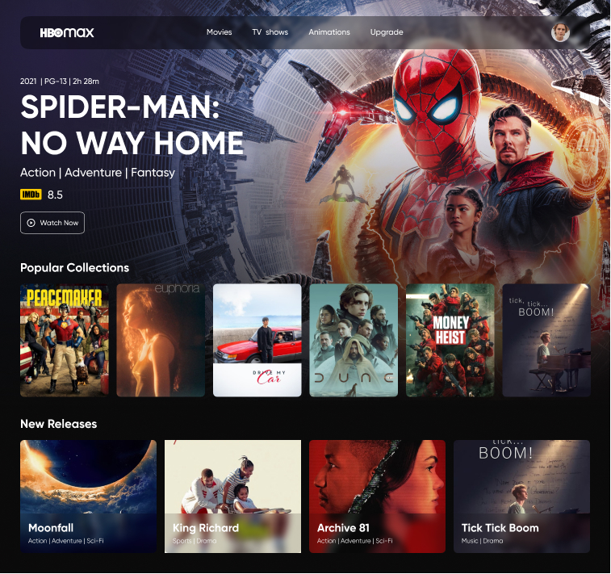

<h1 align="center">HBO Max Redesign Web App</h1>

    

  <a href="#-tecnologias">Tecnologias</a>&nbsp;&nbsp;&nbsp;|&nbsp;&nbsp;&nbsp;
  <a href="#-projeto">Projeto</a>&nbsp;&nbsp;&nbsp;|&nbsp;&nbsp;&nbsp;
  <a href="#memo-licença">Licença</a>

 
  
  

  

 

  

## Tecnologias

Esse projeto foi desenvolvido com as seguintes tecnologias:

### HTML5

### [Tailwind CSS](https://tailwindcss.com/)

## 🚧 Projeto:

[Em construção](https://hbo-max-omega.vercel.app/)

## 🎨 Inspiração:

Figma: https://www.figma.com/file/2A51gQJCk5V6LxcIh2en0b/HBO-Max-Redesign-Web-App-(Community)

## 📝 Licença

Esse projeto está sob a licença MIT. Veja o arquivo LICENSE para mais detalhes.

Made by Jhonatan Oliveira.
